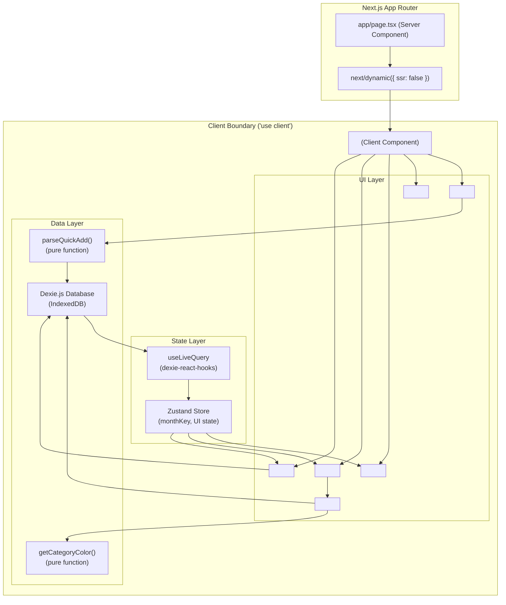

# Design Document: Expense Tracker

## Overview

A local-first personal expense and repayment tracker built for speed and daily use. The app runs entirely in the browser — no backend, no authentication, no sync. All data is persisted to IndexedDB via Dexie.js.

The single-page application is built on Next.js 16 (App Router), TypeScript, Tailwind CSS v4, shadcn/ui, Dexie.js, and Zustand. Because every interactive feature depends on browser APIs (IndexedDB, focus management, keyboard events), the entire interactive shell is a Client Component tree. The Next.js App Router page acts as a thin server-rendered shell that dynamically imports the client application with `ssr: false`.

### Key Design Decisions

- **`ssr: false` boundary at the page level.** The root `app/page.tsx` is a Server Component that uses `next/dynamic` to import `<ExpenseApp>` with `{ ssr: false }`. This is the single SSR boundary. All Dexie.js access, Zustand stores, and browser API calls live inside this boundary. Per the Next.js docs, `ssr: false` must be used inside a Client Component — so `app/page.tsx` wraps the dynamic import in a minimal Client Component shell.
- **Zustand for UI state, Dexie.js as the source of truth.** Zustand holds the active `monthKey` and a reactive snapshot of the current month's expenses. Dexie.js is the authoritative store. Every write goes to Dexie first; the Zustand snapshot is refreshed via a `useLiveQuery` hook from `dexie-react-hooks`.
- **Parser is a pure function.** The Quick Add parser is a pure TypeScript function with no side effects. This makes it trivially testable and composable.
- **Category colors are deterministically derived.** A stable hash of the category label string maps to a fixed palette index, ensuring consistent colors across sessions without storing color assignments.

---

## Architecture



### Data Flow

1. User types into `<QuickAddInput>` and presses Enter.
2. `parseQuickAdd(input)` returns a `ParseResult` (success with `NewExpense` or failure with error message).
3. On success, the app calls `db.expenses.add(expense)` — Dexie writes to IndexedDB.
4. `useLiveQuery` detects the change and re-renders the expense list reactively.
5. Zustand holds only `monthKey` and ephemeral UI state (e.g., which expense card has an open payment form).

---

## Components and Interfaces

### Component Tree

```
app/page.tsx                    (Server Component — thin shell)
└── <ExpenseAppShell />         ('use client' wrapper for next/dynamic)
    └── <ExpenseApp />          (main client root, loaded with ssr:false)
        ├── <QuickAddInput />
        ├── <MonthNavigator />
        ├── <MonthlySummary />
        ├── <RolloverButton />
        └── <ExpenseList />
            └── <ExpenseCard /> (one per expense)
                └── <PartialPaymentForm /> (inline, shown on demand)
```

### Component Interfaces

```typescript
// QuickAddInput
interface QuickAddInputProps {
  onAdd: (expense: NewExpense) => Promise<void>;
  activeMonthKey: string; // "YYYY-MM"
}

// MonthNavigator
interface MonthNavigatorProps {
  activeMonthKey: string;
  onNavigate: (monthKey: string) => void;
}

// MonthlySummary
interface MonthlySummaryProps {
  expenses: Expense[];
}

// RolloverButton
interface RolloverButtonProps {
  expenses: Expense[];
  activeMonthKey: string;
  onRollover: () => Promise<void>;
}

// ExpenseList
interface ExpenseListProps {
  expenses: Expense[];
  onPaymentSubmit: (id: number, amount: number) => Promise<void>;
  onPriorityChange: (id: number, priority: Priority) => Promise<void>;
}

// ExpenseCard
interface ExpenseCardProps {
  expense: Expense;
  onPaymentSubmit: (amount: number) => Promise<void>;
  onPriorityChange: (priority: Priority) => Promise<void>;
}

// PartialPaymentForm
interface PartialPaymentFormProps {
  expense: Expense;
  onSubmit: (amount: number) => Promise<void>;
  onCancel: () => void;
}
```

### Parser Interface

```typescript
// lib/parser.ts — pure functions, no imports from React or Next.js

export type ParseSuccess = {
  ok: true;
  expense: NewExpense;
};

export type ParseFailure = {
  ok: false;
  error: string;
};

export type ParseResult = ParseSuccess | ParseFailure;

export function parseQuickAdd(input: string): ParseResult;

// Serializes an Expense back to a canonical Quick Add string
// Used for round-trip testing (Requirement 1.11)
export function serializeExpense(expense: NewExpense): string;
```

---

## Data Models

### Core Types

```typescript
// types/expense.ts

export type Priority = "High" | "Medium" | "Low";
export type Status = "paid" | "unpaid";

export interface Expense {
  id?: number;           // auto-incremented by Dexie
  title: string;
  totalAmount: number;   // always > 0
  amountPaid: number;    // 0 <= amountPaid <= totalAmount
  status: Status;
  priority: Priority;
  category: string;      // free-text label; empty string if unset
  monthKey: string;      // "YYYY-MM" — the month this expense belongs to
  rolledOver: boolean;   // true if copied from a previous month
  createdAt: number;     // Unix timestamp (ms)
}

// NewExpense omits id and createdAt (set by the store on write)
export type NewExpense = Omit<Expense, "id" | "createdAt">;
```

### Derived / Computed Types

```typescript
// Computed from a set of Expense records
export interface MonthlySummary {
  totalOwed: number;   // sum of totalAmount
  totalPaid: number;   // sum of amountPaid
  progress: number;    // totalPaid / totalOwed, in [0, 1]; 0 when totalOwed === 0
}
```

### IndexedDB Schema (Dexie.js)

```typescript
// lib/db.ts

import Dexie, { type Table } from "dexie";
import type { Expense } from "@/types/expense";

export class ExpenseDatabase extends Dexie {
  expenses!: Table<Expense>;

  constructor() {
    super("ExpenseTrackerDB");
    this.version(1).stores({
      // Indexed columns: id (auto), monthKey, status, priority
      // Non-indexed columns are stored but not queryable by index
      expenses: "++id, monthKey, status, priority",
    });
  }
}

export const db = new ExpenseDatabase();
```

**Index rationale:**
- `++id` — auto-increment primary key.
- `monthKey` — primary query axis; all list views filter by month.
- `status` — used by rollover to find unpaid expenses.
- `priority` — available for future sorting/filtering.

### Zustand Store Shape

```typescript
// store/useExpenseStore.ts

interface ExpenseStore {
  // Active month context
  activeMonthKey: string;           // "YYYY-MM", defaults to current month
  setActiveMonthKey: (key: string) => void;

  // Ephemeral UI state
  openPaymentFormId: number | null; // which expense card has the payment form open
  setOpenPaymentFormId: (id: number | null) => void;
}

// Note: the expense list itself is NOT stored in Zustand.
// It is derived reactively from Dexie via useLiveQuery in the component tree.
// This avoids double-source-of-truth bugs.
```

### monthKey Format

All month references use the string format `"YYYY-MM"` (e.g., `"2025-06"`). This is lexicographically sortable and unambiguous.

```typescript
// lib/monthKey.ts

export function toMonthKey(date: Date): string {
  return `${date.getFullYear()}-${String(date.getMonth() + 1).padStart(2, "0")}`;
}

export function currentMonthKey(): string {
  return toMonthKey(new Date());
}

export function nextMonthKey(key: string): string {
  const [year, month] = key.split("-").map(Number);
  const d = new Date(year, month); // month is 0-indexed; month+1 wraps correctly
  return toMonthKey(d);
}

export function prevMonthKey(key: string): string {
  const [year, month] = key.split("-").map(Number);
  const d = new Date(year, month - 2);
  return toMonthKey(d);
}

export function formatMonthKey(key: string): string {
  const [year, month] = key.split("-").map(Number);
  return new Date(year, month - 1).toLocaleString("default", {
    month: "long",
    year: "numeric",
  });
}
```

---

## Parser Logic

The Quick Add parser is a pure function that tokenizes the input string and classifies each token.

### Tokenization Rules

1. Split input on whitespace.
2. For each token:
   - If it matches `/^-?\d+(\.\d+)?$/` → **amount token** (numeric).
   - If it matches `/^(paid|unpaid)$/i` → **status token**.
   - Otherwise → **title token**.
3. If no amount token is found → return `ParseFailure` with error `"Amount is required"`.
4. If multiple amount tokens are found → use the last one (last-wins rule).
5. If multiple status tokens are found → use the last one.
6. Title = title tokens joined with a single space, trimmed.
7. If title is empty after joining → use `"Untitled"` as the default title.

### Parser Implementation Sketch

```typescript
export function parseQuickAdd(input: string): ParseResult {
  const tokens = input.trim().split(/\s+/).filter(Boolean);

  let amount: number | null = null;
  let status: Status = "unpaid";
  const titleTokens: string[] = [];

  for (const token of tokens) {
    if (/^-?\d+(\.\d+)?$/.test(token)) {
      amount = parseFloat(token);
    } else if (/^paid$/i.test(token)) {
      status = "paid";
    } else if (/^unpaid$/i.test(token)) {
      status = "unpaid";
    } else {
      titleTokens.push(token);
    }
  }

  if (amount === null) {
    return { ok: false, error: "Amount is required. Try: 'Coffee 4.50'" };
  }

  const title = titleTokens.join(" ").trim() || "Untitled";

  return {
    ok: true,
    expense: {
      title,
      totalAmount: Math.abs(amount),
      amountPaid: status === "paid" ? Math.abs(amount) : 0,
      status,
      priority: "Medium",
      category: "",
      monthKey: "", // assigned by caller from active month context
      rolledOver: false,
    },
  };
}
```

### Serialization (for round-trip testing)

```typescript
export function serializeExpense(expense: NewExpense): string {
  const parts: string[] = [];
  if (expense.title && expense.title !== "Untitled") {
    parts.push(expense.title);
  }
  parts.push(String(expense.totalAmount));
  if (expense.status !== "unpaid") {
    parts.push(expense.status);
  }
  return parts.join(" ");
}
```

The serializer produces a canonical string that, when re-parsed, yields an equivalent `NewExpense`. This enables the round-trip property test (Requirement 1.11).

---

## Local Persistence Design

### SSR Safety Pattern

Because `next/dynamic` with `ssr: false` must be called from a Client Component (per Next.js 16 docs), the pattern is:

```typescript
// app/page.tsx — Server Component
import { ExpenseAppShell } from "@/components/ExpenseAppShell";

export default function Page() {
  return <ExpenseAppShell />;
}
```

```typescript
// components/ExpenseAppShell.tsx — Client Component
"use client";

import dynamic from "next/dynamic";

const ExpenseApp = dynamic(() => import("@/components/ExpenseApp"), {
  ssr: false,
  loading: () => (
    <div className="flex h-screen items-center justify-center text-zinc-400">
      Loading…
    </div>
  ),
});

export function ExpenseAppShell() {
  return <ExpenseApp />;
}
```

```typescript
// components/ExpenseApp.tsx — Client Component (loaded only in browser)
"use client";

import { db } from "@/lib/db";
// ... Dexie, Zustand, useLiveQuery all safe here
```

### Dexie.js Live Queries

Expense lists are derived reactively using `useLiveQuery` from `dexie-react-hooks`:

```typescript
// Inside ExpenseApp or ExpenseList
import { useLiveQuery } from "dexie-react-hooks";
import { db } from "@/lib/db";

const expenses = useLiveQuery(
  () => db.expenses.where("monthKey").equals(activeMonthKey).toArray(),
  [activeMonthKey],
  [] // initial value while loading
);
```

This means the UI automatically re-renders whenever IndexedDB changes — no manual cache invalidation needed.

### Write Operations

All writes follow the pattern: write to Dexie → `useLiveQuery` triggers re-render.

```typescript
// Add expense
await db.expenses.add({ ...expense, createdAt: Date.now() });

// Update partial payment
await db.expenses.update(id, {
  amountPaid: newAmountPaid,
  status: newAmountPaid >= expense.totalAmount ? "paid" : "unpaid",
});

// Update priority
await db.expenses.update(id, { priority });

// Rollover
const unpaid = await db.expenses
  .where("monthKey").equals(sourceMonthKey)
  .and((e) => e.status === "unpaid")
  .toArray();

const copies = unpaid.map(({ id: _id, createdAt: _c, ...rest }) => ({
  ...rest,
  monthKey: targetMonthKey,
  rolledOver: true,
  createdAt: Date.now(),
}));

await db.expenses.bulkAdd(copies);
```

### IndexedDB Unavailability

On initialization, `ExpenseApp` wraps the Dexie instantiation in a try/catch. If IndexedDB is unavailable (e.g., private browsing in some browsers, or a non-browser environment), the app renders a persistent warning banner and operates in a degraded read-only mode with no persistence.

---

## UI/UX Design

### Visual Language

The design follows the premium fintech aesthetic described in Requirement 11:

| Token | Value |
|---|---|
| Base palette | `zinc-50` / `zinc-100` / `zinc-900` |
| Accent (primary) | `violet-600` (progress bars, focus rings, active states) |
| Accent (secondary) | `emerald-500` (paid status, success states) |
| Border radius | `rounded-2xl` on cards; `rounded-xl` on inputs/buttons |
| Shadow | `shadow-sm` with `border border-zinc-200` |
| Font hierarchy | `text-base font-semibold` (title), `text-sm text-zinc-500` (meta), `text-xs text-zinc-400` (secondary) |

### Layout

```
┌─────────────────────────────────────────────────────┐
│  [sticky] Quick Add Input                           │  ← position: sticky, top-0, z-10
├─────────────────────────────────────────────────────┤
│  ← June 2025 →   [Roll Over]                        │  ← MonthNavigator + RolloverButton
├─────────────────────────────────────────────────────┤
│  Total Owed: $420   Paid: $180   ████░░░░ 43%       │  ← MonthlySummary
├─────────────────────────────────────────────────────┤
│  ┌─────────────────────────────────────────────┐    │
│  │ 🔴 High  Rent          $1200  ████████ 100% │    │  ← ExpenseCard (paid)
│  └─────────────────────────────────────────────┘    │
│  ┌─────────────────────────────────────────────┐    │
│  │ 🟡 Med   Coffee        $4.50  ░░░░░░░░   0% │    │  ← ExpenseCard (unpaid)
│  └─────────────────────────────────────────────┘    │
└─────────────────────────────────────────────────────┘
```

### Priority Badges

| Priority | Color | Icon |
|---|---|---|
| High | `text-red-600 bg-red-50` | `⬆` (ArrowUp icon) |
| Medium | `text-amber-600 bg-amber-50` | `➡` (Minus icon) |
| Low | `text-zinc-500 bg-zinc-100` | `⬇` (ArrowDown icon) |

### Category Color Assignment

Category colors are derived deterministically from the label string using a stable hash:

```typescript
// lib/categoryColor.ts

const CATEGORY_PALETTE = [
  "bg-green-100 text-green-700",
  "bg-blue-100 text-blue-700",
  "bg-emerald-100 text-emerald-700",
  "bg-amber-100 text-amber-700",
  "bg-rose-100 text-rose-700",
  "bg-cyan-100 text-cyan-700",
  "bg-teal-100 text-teal-700",
  "bg-orange-100 text-orange-700",
];

function hashString(s: string): number {
  let h = 0;
  for (let i = 0; i < s.length; i++) {
    h = (Math.imul(31, h) + s.charCodeAt(i)) | 0;
  }
  return Math.abs(h);
}

export function getCategoryColor(label: string): string {
  if (!label) return "bg-zinc-100 text-zinc-500";
  return CATEGORY_PALETTE[hashString(label) % CATEGORY_PALETTE.length];
}
```

### Progress Bar

The progress bar uses a CSS custom property for the fill width, enabling smooth transitions:

```tsx
<div
  className="h-2 w-full rounded-full bg-zinc-100 overflow-hidden"
  role="progressbar"
  aria-valuenow={percent}
  aria-valuemin={0}
  aria-valuemax={100}
>
  <div
    className="h-full rounded-full bg-green-500 transition-[width] duration-300 ease-out motion-reduce:transition-none"
    style={{ width: `${percent}%` }}
  />
</div>
```

The `motion-reduce:transition-none` class respects `prefers-reduced-motion` (Requirement 11.11).

### Hover and Focus States

All interactive elements use:
- `transition-colors duration-150` (≤ 200ms per Requirement 11.9)
- `focus-visible:ring-2 focus-visible:ring-green-500 focus-visible:ring-offset-2` for WCAG 2.1 AA focus visibility
- `motion-reduce:transition-none` on all transition utilities

---

## Keyboard Interaction Design

| Action | Keyboard |
|---|---|
| Submit Quick Add | `Enter` |
| Navigate expense list | `Tab` / `Shift+Tab` (between cards), `↑` / `↓` (within list) |
| Open payment form on focused card | `P` or `Enter` |
| Submit payment form | `Enter` |
| Cancel payment form | `Escape` |
| Navigate months | `←` / `→` arrow keys on the month navigator |

On app load, `<QuickAddInput>` receives `autoFocus`. After a successful add, focus is programmatically returned to the input via `inputRef.current?.focus()`.

The expense list uses `role="list"` with each card as `role="listitem"`. Cards are focusable via `tabIndex={0}` and handle `onKeyDown` for `P`, `Enter`, and `Escape`.

---

## Correctness Properties

*A property is a characteristic or behavior that should hold true across all valid executions of a system — essentially, a formal statement about what the system should do. Properties serve as the bridge between human-readable specifications and machine-verifiable correctness guarantees.*

The parser (`lib/parser.ts`) and the business logic functions (`lib/categoryColor.ts`, `lib/monthKey.ts`, rollover logic) are pure functions well-suited to property-based testing. The UI rendering and persistence layers use example-based and integration tests instead.

### Property 1: Parser round-trip

*For any* valid Quick Add input string (containing at least one numeric token), parsing it to a `NewExpense`, serializing that expense back to a string, and parsing the result again SHALL produce a `NewExpense` that is equivalent to the first parse result.

**Validates: Requirements 1.11**

### Property 2: Parser always extracts a valid amount

*For any* input string containing exactly one numeric token, the parser SHALL return a success result whose `totalAmount` equals the absolute value of that numeric token.

**Validates: Requirements 1.5**

### Property 3: Parser rejects inputs with no numeric token

*For any* input string containing no numeric tokens, the parser SHALL return a failure result (i.e., `ok: false`).

**Validates: Requirements 1.6**

### Property 4: Parser status extraction

*For any* input string containing the word "paid" or "unpaid" (in any casing), the parser SHALL set the expense `status` to the matched keyword (normalized to lowercase). For any input string containing no status keyword, the parser SHALL default `status` to `"unpaid"`.

**Validates: Requirements 1.3, 1.4**

### Property 5: Parser default priority

*For any* valid input string, the parser SHALL always produce a `NewExpense` with `priority` equal to `"Medium"`.

**Validates: Requirements 1.8, 4.2**

### Property 6: Parser title construction

*For any* input string, the parser's title SHALL be the concatenation (space-joined) of all tokens that are neither a numeric token nor a status keyword. If no such tokens exist, the title SHALL be `"Untitled"`.

**Validates: Requirements 1.7**

### Property 7: Category color consistency

*For any* non-empty category label string, `getCategoryColor(label)` SHALL always return the same color class string regardless of how many times it is called or in what order.

**Validates: Requirements 5.3, 5.4**

### Property 8: Partial payment accumulation and capping

*For any* expense with `totalAmount > 0` and any payment amount `p > 0`, applying the payment SHALL result in `newAmountPaid = min(oldAmountPaid + p, totalAmount)` and `status = "paid"` if and only if `newAmountPaid >= totalAmount`.

**Validates: Requirements 3.1, 3.3, 3.5**

### Property 9: Partial payment rejection

*For any* payment amount `p ≤ 0`, the payment SHALL be rejected and the expense SHALL remain unchanged.

**Validates: Requirements 3.4**

### Property 10: Rollover preserves fields and sets flag

*For any* set of unpaid expenses rolled over from month M to month M+1, each rolled-over copy SHALL have the same `title`, `totalAmount`, `amountPaid`, `priority`, and `category` as the original, SHALL have `rolledOver = true`, and SHALL have `monthKey` equal to the next month's key.

**Validates: Requirements 7.2, 7.3, 7.4**

### Property 11: Rollover does not mutate originals

*For any* rollover operation, the original expenses in the source month SHALL remain unchanged after the rollover completes.

**Validates: Requirements 7.5**

### Property 12: Monthly summary calculation

*For any* non-empty set of expenses, the `MonthlySummary` SHALL have `totalOwed = sum(e.totalAmount)`, `totalPaid = sum(e.amountPaid)`, and `progress = totalPaid / totalOwed`.

**Validates: Requirements 8.1, 8.2, 8.3**

### Property 13: Monthly summary empty state

*For* an empty set of expenses, the `MonthlySummary` SHALL have `totalOwed = 0`, `totalPaid = 0`, and `progress = 0`.

**Validates: Requirements 8.5**

---

## Error Handling

| Scenario | Handling |
|---|---|
| Quick Add with no amount | Inline error below input: "Amount is required. Try: 'Coffee 4.50'" |
| Partial payment ≤ 0 | Inline error in payment form: "Payment amount must be greater than zero" |
| Partial payment exceeds remaining | Cap at remaining balance; no error shown (silent cap per Req 3.5) |
| IndexedDB unavailable | Persistent warning banner at top of app; app renders but does not persist |
| Dexie write failure | Toast notification: "Failed to save. Please try again." |
| Empty Quick Add submission | No-op; no error (empty string produces no tokens, which triggers the "no amount" error) |

All error messages are rendered inline adjacent to the triggering input, not as modal dialogs, to preserve keyboard flow.

---

## Testing Strategy

### Unit Tests (example-based)

Focus on specific behaviors and edge cases:

- Parser: empty input, input with only whitespace, multiple numeric tokens, mixed-case status keywords, title with special characters
- `getCategoryColor`: same label always returns same color, empty label returns default
- `monthKey` utilities: `nextMonthKey` wraps December → January correctly, `prevMonthKey` wraps January → December
- `MonthlySummary` calculation: empty array, single expense, all-paid expenses
- Rollover: only unpaid expenses are copied, paid expenses are left behind

### Property-Based Tests

Use **fast-check** (TypeScript-native PBT library). Each property test runs a minimum of **100 iterations**.

Tag format: `// Feature: expense-tracker, Property N: <property text>`

Properties to implement as PBT tests:

| Test | Property | fast-check Arbitraries |
|---|---|---|
| Parser round-trip | Property 1 | `fc.array(fc.string())` assembled into valid input strings |
| Amount extraction | Property 2 | `fc.float({ min: 0.01 })` embedded in random strings |
| Rejection of no-amount inputs | Property 3 | `fc.array(fc.string())` filtered to exclude numeric tokens |
| Status extraction | Property 4 | `fc.constantFrom("paid", "PAID", "Paid", "unpaid", "UNPAID")` |
| Default priority | Property 5 | Any valid input string |
| Title construction | Property 6 | `fc.array(fc.string())` with known title tokens |
| Category color consistency | Property 7 | `fc.string({ minLength: 1 })` |
| Payment accumulation | Property 8 | `fc.record({ totalAmount: fc.float({ min: 0.01 }), amountPaid: fc.float({ min: 0 }) })` |
| Payment rejection | Property 9 | `fc.float({ max: 0 })` |
| Rollover field preservation | Property 10 | `fc.array(fc.record(...))` of unpaid expenses |
| Rollover non-mutation | Property 11 | Same as Property 10 |
| Summary calculation | Property 12 | `fc.array(fc.record(...), { minLength: 1 })` |
| Summary empty state | Property 13 | Constant empty array |

### Integration Tests

- Dexie.js write → `useLiveQuery` → UI update (using `fake-indexeddb` for in-memory IndexedDB)
- App load reads existing IndexedDB records
- Rollover writes correct records to next month in IndexedDB

### Accessibility Tests

- Focus management: autofocus on load, focus returns to input after add
- Keyboard navigation through expense list
- WCAG 2.1 AA focus indicator visibility (automated check via `jest-axe` or `@axe-core/react`)

### Visual / Snapshot Tests

- Priority badge renders correct color and icon for each level
- Category tag renders with correct color class
- Paid expense renders with visual distinction
- Rolled-over expense renders badge
- Progress bar renders correct width percentage
