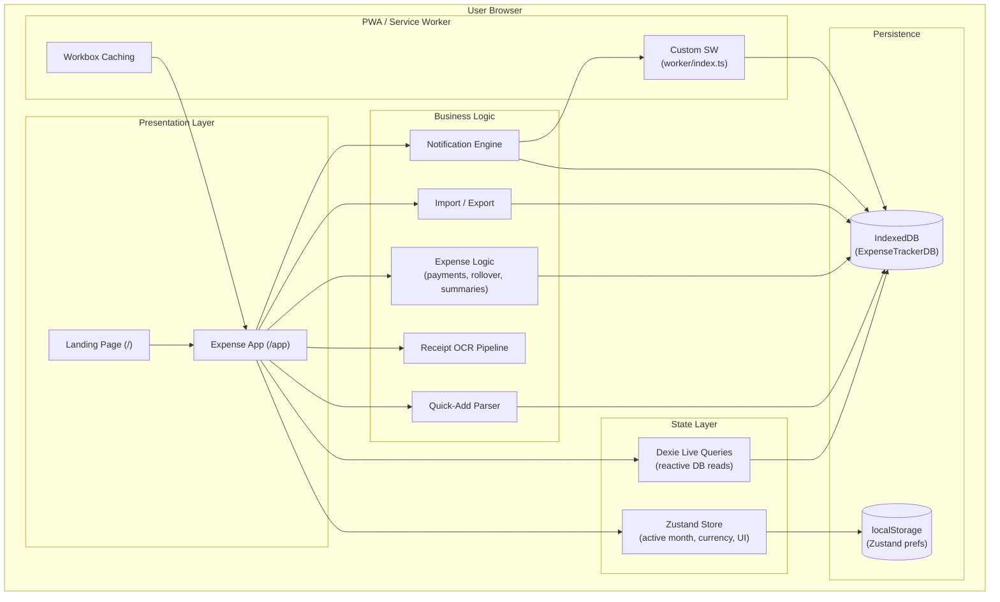
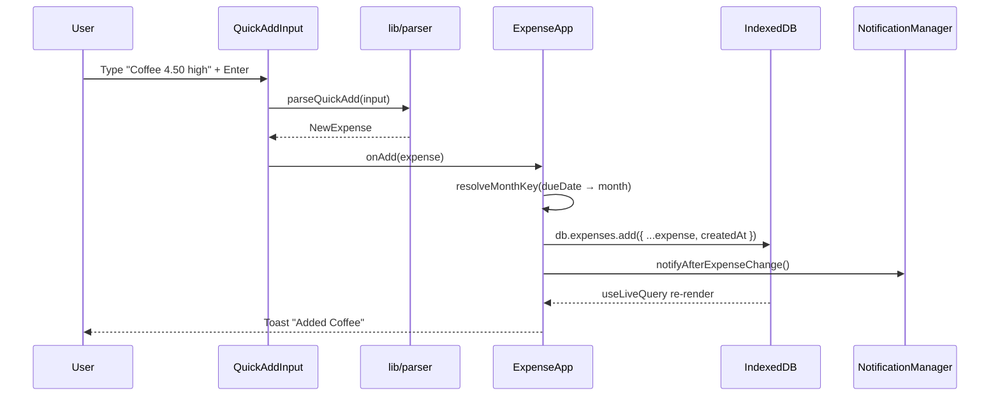
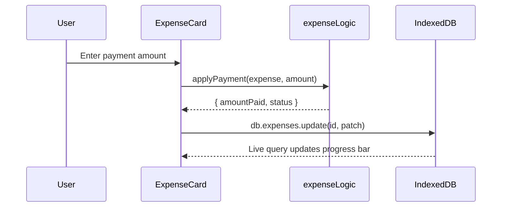
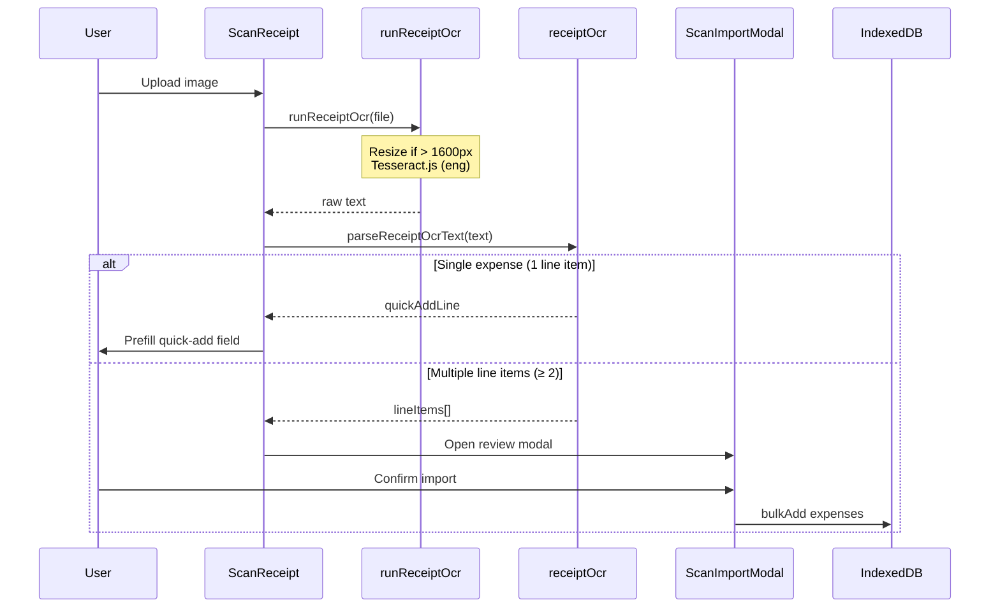
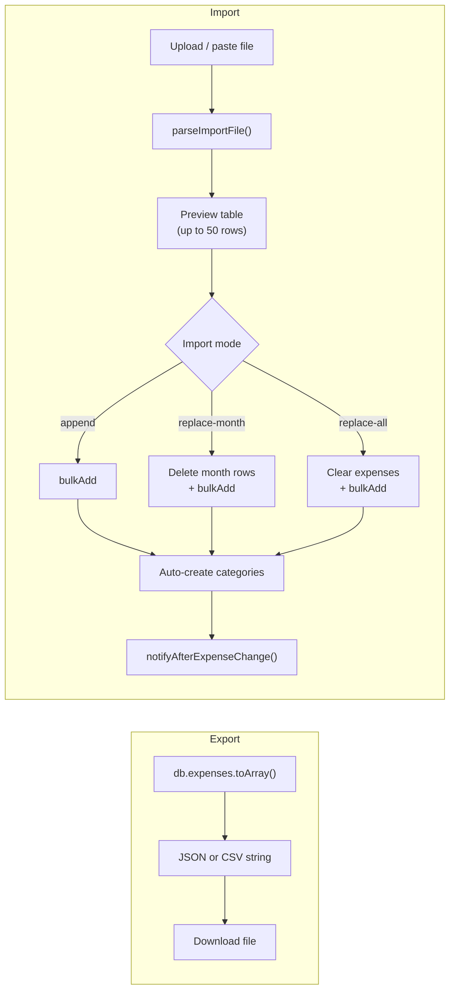
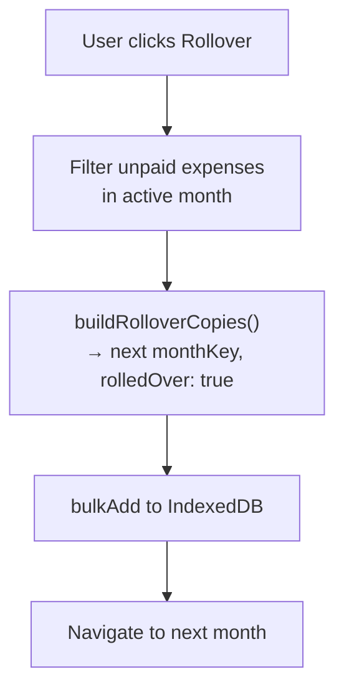
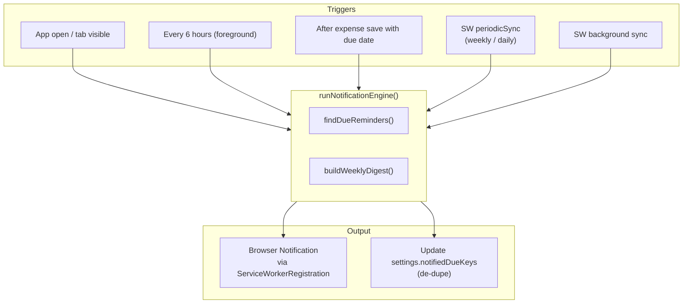

# Expensio — System Architecture

> **Expensio** is a local-first, browser-based personal expense tracker. There is no backend, no user accounts, and no cloud sync. All data lives in the user's browser (IndexedDB + selective localStorage). This document describes how the system is structured and how data flows through it.

---

## 1. High-Level Overview



### Design Principles

| Principle | Implementation |
|-----------|----------------|
| **Local-first** | All reads/writes go to IndexedDB via Dexie; no API calls for core data |
| **Offline-capable** | PWA with service worker caches static assets; app shell works offline after first load |
| **Privacy by default** | No authentication, no telemetry on expense data (Vercel Analytics on pages only) |
| **Reactive UI** | `dexie-react-hooks` `useLiveQuery` re-renders components when DB changes |
| **Client-only OCR** | Tesseract.js runs in-browser; receipt images never leave the device |

---

## 2. Technology Stack

| Layer | Technology | Role |
|-------|------------|------|
| Framework | Next.js 16 (App Router) | Routing, SSR shell, production build |
| UI | React 19, Tailwind CSS 4, shadcn/ui (base-nova), Base UI | Components and styling |
| Database | Dexie 4 (IndexedDB) | Persistent expense, category, and notification settings storage |
| Client state | Zustand (persisted) | Ephemeral UI prefs: currency, active month |
| Charts | Recharts | Category breakdown, paid vs unpaid insights |
| OCR | Tesseract.js | Receipt text extraction |
| PWA | `@ducanh2912/next-pwa` + custom worker | Installability, background notifications |
| Toasts | Sonner | User feedback (add, delete, import, undo) |
| Testing | Vitest | Unit tests for parser, import, notifications, month keys |
| Tooling | TypeScript, ESLint, Biome | Type safety, lint, format |

---

## 3. Application Routes

```
/               → Landing page (marketing, static SSR)
/app            → Main expense tracker (client-only shell)
```

The app route loads `ExpenseAppShell`, which dynamically imports `ExpenseApp` with `ssr: false` to avoid IndexedDB access during server render. Supporting providers on `/app`:

- `NotificationManager` — foreground notification polling
- `Toaster` — Sonner toast host
- `PWAUpdatePrompt` — prompts user when a new SW version is available

---

## 4. Layered Architecture

### 4.1 Presentation Layer (`components/`)

| Component | Responsibility |
|-----------|----------------|
| `ExpenseApp` | Root orchestrator: CRUD handlers, search, modals, month navigation |
| `QuickAddInput` | Text input + Enter to parse and create expenses |
| `ScanReceipt` | Image upload → OCR → prefill or bulk import modal |
| `ExpenseList` | Virtualized, paginated month list (`@tanstack/react-virtual` + Dexie pages) |
| `EditExpenseModal` | Full edit form (title, amount, category, due date, note, etc.) |
| `PartialPaymentForm` | Record incremental payments |
| `MonthlySummary` | Aggregated totals and insight line |
| `InsightsDashboard` | Charts (category spend, priority breakdown) |
| `DataMenu` | ⋯ menu: import/export, appearance (theme + accent) |
| `AppCommandMenu` | Command palette (`cmdk`) — search, navigation, shortcuts |
| `ImportModal` | Bulk import with preview and modes |
| `SettingsDialog` | Notifications, recurring templates, categories/budgets |
| `RolloverButton` | Copy unpaid expenses to next month |
| `AppTour` | First-run onboarding (driver.js); highlights ⋯ menu without opening it |
| `BenchmarkDevTools` | Dev-only `window.expensio` seed helpers |

UI primitives live in `components/ui/` (shadcn-generated).

### 4.2 State Layer

**Zustand (`store/useExpenseStore.ts`)**

Persisted to `localStorage` under key `expensio-store-v1`:

- `currency` — display symbol (`USD` | `NGN`)
- `accent` — UI accent (`green` | `blue` | `purple`)

Ephemeral (session UI):

- `activeMonthKey` — currently viewed month (`YYYY-MM`)
- `openPaymentFormId` — which expense has payment form open

Theme (light / dark / system) is persisted by `next-themes` under `expensio-color-mode`.

**Dexie Live Queries**

Month list data uses paginated reads (`lib/monthExpenseQueries.ts`) — 50 expenses per page, infinite scroll — while summary totals use `computeMonthTotals()` (full-month scan without loading all rows into the list). Other surfaces still use `useLiveQuery` where appropriate:

```typescript
const monthTotals = useLiveQuery(() => computeMonthTotals(activeMonthKey), [activeMonthKey]);
```

No manual cache invalidation — writes to Dexie automatically trigger re-renders. List edits use optimistic `patchExpense` for instant UI.

### 4.2.1 List performance

| Layer | Mechanism | Purpose |
|-------|-----------|---------|
| Pagination | `fetchMonthExpensePage` + Intersection Observer | Load 50 rows at a time from IndexedDB |
| Virtualization | `@tanstack/react-virtual` `useWindowVirtualizer` | Render ~20 DOM nodes regardless of loaded count |
| Skeletons | `ExpenseRowSkeleton`, `MonthlySummarySkeleton` | Reserve layout space during loads |

Compound index `[monthKey+createdAt]` (Dexie v5) supports efficient paged queries.

### 4.3 Business Logic Layer (`lib/`)

| Module | Responsibility |
|--------|----------------|
| `parser.ts` | Parse quick-add text → `NewExpense` |
| `expenseLogic.ts` | Payments, rollover copies, monthly summary math |
| `monthKey.ts` | Month key helpers (`currentMonthKey`, `parseMonthLabel`, formatting) |
| `monthExpenseQueries.ts` | Paginated month fetch, totals scan, search |
| `keyboard.ts` | Platform-aware shortcut labels (`⌘` vs `Ctrl`) |
| `seedBenchmark.ts` | Dev-only fake expense generator |
| `exportImport.ts` | JSON/CSV/TSV parse, validate, sanitize, bulk commit |
| `receiptOcr.ts` | Parse OCR text → amount, merchant, line items |
| `runReceiptOcr.ts` | Image prep + Tesseract worker lifecycle |
| `categoryColor.ts` | Deterministic category color assignment |
| `useCurrency.ts` | Format amounts with active currency symbol |
| `logService.ts` | Namespaced client-side logging |

### 4.4 Persistence Layer (`lib/db.ts`)

**Database:** `ExpenseTrackerDB` (Dexie v5)

| Table | Schema | Purpose |
|-------|--------|---------|
| `expenses` | `++id, monthKey, status, priority, [monthKey+createdAt]` | All expense records |
| `categories` | `++id, &name` | Category names + optional monthly budget (`maxAmount`) |
| `settings` | `id` | Notification settings (singleton row `id: 1`) |
| `templates` | `++id, title` | Recurring expense templates |

**Types:** defined in `types/expense.ts` and `types/notification.ts`.

---

## 5. Core Data Flows

### 5.1 Quick Add Expense



**Month resolution:** If `dueDate` falls in a different month than the active view, the expense is filed to that month automatically (`resolveMonthKey` in `ExpenseApp`).

### 5.2 Partial Payment



`applyPayment` caps `amountPaid` at `totalAmount` and flips `status` to `"paid"` when fully paid.

### 5.3 Receipt Scan



OCR is fully client-side. First run may download Tesseract language data (~several MB).

### 5.4 Bulk Import / Export



**Guards:** max 10,000 records, 5 MB file size, field sanitization, safe JSON parse.

**Formats:** JSON (`{ version: 1, expenses: [...] }`), CSV, TSV (auto-detected on paste).

### 5.5 Month Rollover



Original expenses remain in the source month; copies are new records in the target month.

### 5.6 Notifications



| Notification type | Condition | Tag |
|-------------------|-----------|-----|
| Due today | `dueDate` is today, unpaid, not yet notified | `due-{expenseId}-{dayMs}` |
| Overdue | `dueDate` < today, unpaid | same key scheme |
| Weekly digest | Unpaid summary across all months | `weekly-digest` |

Settings stored in `db.settings` (singleton). Permission requested via `NotificationSettings` UI. Background delivery uses custom service worker at `worker/index.ts`.

---

## 6. PWA & Service Worker

**Config:** `next.config.ts` wraps Next.js with `@ducanh2912/next-pwa`.

| Setting | Value | Rationale |
|---------|-------|-----------|
| `disable` in dev | `true` | Avoid SW interference during development |
| `cacheOnFrontEndNav` | `false` | Prevent broken RSC payloads on iOS Safari |
| Navigate requests | `NetworkOnly` | Always fetch fresh HTML/RSC |
| `/_next/static/*` | `CacheFirst` | Fast repeat loads |
| Custom worker | `worker/index.ts` | Periodic sync + notification click handler |

**Install flow:** `app/manifest.ts` defines PWA metadata. `PWAUpdatePrompt` notifies when a new build is available.

---

## 7. Module Dependency Map

```
app/
├── page.tsx                    # Landing (no DB)
├── app/page.tsx                # App shell entry
├── layout.tsx                  # Root layout, fonts, analytics
└── manifest.ts                 # PWA manifest

components/
├── ExpenseApp.tsx              # Central controller
├── ExpenseAppShell.tsx         # Dynamic import boundary (no SSR)
├── NotificationManager.tsx     # Foreground notification loop
└── ui/                         # shadcn primitives

lib/
├── db.ts                       # Dexie schema (foundation)
├── parser.ts                   # Quick-add parsing
├── expenseLogic.ts             # Pure business rules
├── exportImport.ts             # Bulk data I/O
├── receiptOcr.ts               # OCR text parsing
├── runReceiptOcr.ts            # Tesseract integration
├── monthKey.ts                 # Date/month utilities
└── notifications/
    ├── engine.ts               # Core notification logic (shared SW + client)
    ├── client.ts               # Browser notification API wrapper
    ├── settings.ts             # Read/write notification settings
    ├── dueDates.ts             # Due-date reminder finder
    ├── digest.ts               # Weekly digest builder
    ├── sw-run.ts               # SW-side engine runner
    └── idb.ts                  # IDB access from service worker

store/
└── useExpenseStore.ts          # Zustand (currency, month, UI)

types/
├── expense.ts                  # Expense, Category, MonthlySummary
└── notification.ts             # NotificationSettings

worker/
└── index.ts                    # Custom service worker extensions
```

**Dependency rule:** `types/` and `lib/expenseLogic.ts` have no UI dependencies. `lib/notifications/engine.ts` is shared between client and service worker. Components import from `lib/` and `store/` but not vice versa.

---

## 8. Data Model (Summary)

### Expense

| Field | Type | Notes |
|-------|------|-------|
| `id` | `number` | Auto-increment (Dexie) |
| `title` | `string` | Required |
| `totalAmount` | `number` | > 0 |
| `amountPaid` | `number` | 0 ≤ paid ≤ total |
| `status` | `"paid" \| "unpaid"` | Derived on full payment |
| `priority` | `"High" \| "Medium" \| "Low"` | Default: Medium |
| `category` | `string` | Free text; empty if unset |
| `monthKey` | `string` | `YYYY-MM` |
| `rolledOver` | `boolean` | True if copied from prior month |
| `createdAt` | `number` | Unix ms |
| `dueDate` | `number?` | Unix ms |
| `note` | `string?` | Free text |

### Category

| Field | Type | Notes |
|-------|------|-------|
| `id` | `number` | Auto-increment |
| `name` | `string` | Unique index |
| `maxAmount` | `number` | Monthly budget; 0 = no limit |

---

## 9. Error Handling & Resilience

| Scenario | Behavior |
|----------|----------|
| IndexedDB unavailable (private browsing, quota) | `ExpenseApp` shows `dbUnavailable` banner |
| Quick-add parse failure | Inline error in `QuickAddInput` |
| Receipt OCR failure | Toast error; user enters manually |
| Import validation errors | Row-level errors in preview; valid rows still import |
| Delete expense | Soft undo via Sonner toast action (re-inserts record) |
| SW periodic sync denied | Falls back to foreground 6-hour polling |

---

## 10. Build & Deploy

```bash
pnpm install
pnpm build    # Next.js production build + PWA asset generation → public/
pnpm start    # Production server
```

**Deployment target:** Standard Next.js hosting (e.g. Vercel). Data is per-browser — deploying a new version does not migrate user data. Zustand and tour keys are versioned (`expensio-store-v1`, `expensio-tour-done-v2`) to reduce cross-deployment collisions.

---

## 11. Testing Strategy

| Area | Location | Coverage |
|------|----------|----------|
| Month key utilities | `lib/__tests__/monthKey.test.ts` | Date edge cases |
| Import/export | `lib/__tests__/exportImport.test.ts` | Parse, validate, modes |
| Receipt OCR parsing | `lib/__tests__/receiptOcr.test.ts` | Text extraction heuristics |
| Notifications | `lib/__tests__/notifications.test.ts` | Engine logic, de-dupe |

Run: `pnpm test`

---

## 12. Extension Points

When adding features, prefer these integration points:

| Feature type | Hook into |
|--------------|-----------|
| New expense field | `types/expense.ts` → Dexie migration → `parser.ts` + `exportImport.ts` CSV headers |
| New notification type | `lib/notifications/engine.ts` + `types/notification.ts` |
| New data source | `lib/exportImport.ts` parse pipeline |
| New UI view | `ExpenseApp.tsx` tab/modal pattern + `useLiveQuery` |
| Background task | `worker/index.ts` event listener + `lib/notifications/sw-run.ts` |

**Out of scope by design:** server API, multi-device sync, user accounts, shared budgets.

---

*Last updated: June 2025 — reflects Expensio v0.1.x codebase.*
